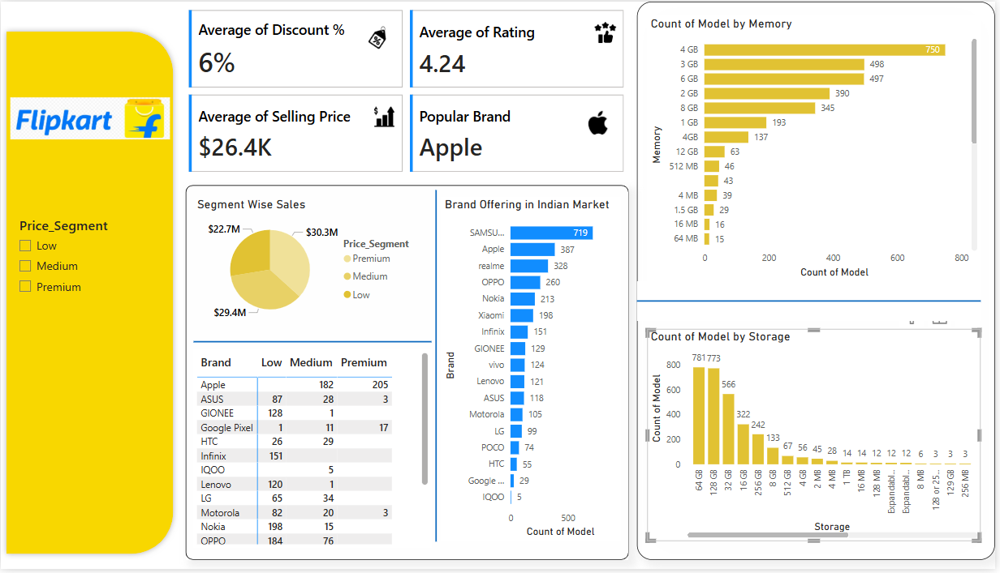

Flipkart Mobile Market Analysis Dashboard
📂 Project Overview
This dashboard presents a detailed data visualization of the Indian mobile market on Flipkart, designed to provide insights into mobile offerings by various brands, their price segments, specifications, and overall market trends.

The analysis answers key business questions posed by stakeholders to help in decision-making for marketing, inventory planning, and customer targeting.

✅ Key Features & Insights Covered
Price Segments Covered

Low, Medium, Premium

Clear segmentation shown with corresponding sales contribution in a Pie Chart.

Top Brands in the Market

Samsung leads with the highest number of offerings.

Brand comparison visualized with a bar chart for quick reference.

Brands Catering to All Segments

Visual Brand vs Segment table helps identify brands offering across Low, Medium, and Premium price points.

Common Specifications

RAM (Memory): 4GB is the most popular.

Storage: 64GB and 128GB dominate the offerings.

KPI Highlights

📉 Average Discount: 6%

⭐ Average Rating: 4.24

💰 Average Selling Price: $26.4K

🏆 Popular Brand: Apple

📊 Visualizations Used
Visualization Type	Description
Pie Chart	Segment-wise Sales Contribution
Bar Charts	- Brand Offering Count
- Memory Count
- Storage Count
Data Table	Brand offerings by price segment
KPI Cards	Key Metrics summary

